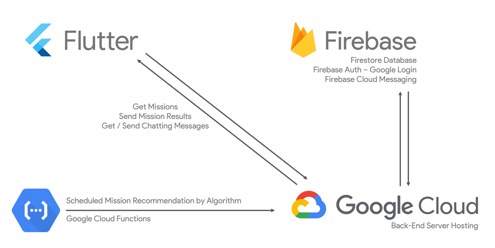

# Project Wiro

## An App-based Platform to reduce the incidence of lonely deaths.

---

## Problem Statement

South Korea is confronting a significant problem of lonely death among seniors live alone,
which is expected to worsen due to issues like aging society.

Through Our in-depth research we found that elderly individuals
who live alone are dealing with several issues in their daily lives.

We took 3rd and 11th SDGs to deal with this society problem.

Overall process of our solution is as follows.

1. Each user get two notifications each day. One is a Mission, another one is a Checklist.
2. Users completes the missions or reply to the checklists they received.
3. If there is no complete/reply sign, or our Deep Learning Algorithm decided that a user is in danger, it automatically sends SOS sign to their family, caregivers, thus preventing potential tragedies.

### Target SDGs

- Goal 3. Good Health and Well-Being
- Goal 11. Sustainable Cities and Communities

---

## High-Level Architecture Diagram

</img>

### How Each Components Work?

- **Cloud Function** decides Mission / CheckList based on our Algorithm for each user, and sends it to user via **Firebase Cloud Messaging**
- Personal Data or Mission / CheckList History, and all of necessary data of each user is saved to **Firebase Firestore**

[Flutter Application Repository](https://github.com/GDSC-CAU/Solution-Challenge-Team-2-Flutter-App)

[Back-End Repository](https://github.com/GDSC-CAU/Solution-Challenge-Team-2-Spring-BE)

[Python AI Repository](https://github.com/GDSC-CAU/Solution-Challenge-Team-2-Python-AI)

---

## Team Info

- Yongmin Yoo (유용민)
    - GDSC CAU 22-23 Core Member
    - Team Leader / Flutter Application / Firebase Firestore
    - [Github](https://github.com/yymin1022)

---

- Sangwoo Shin (신상우)
    - GDSC CAU 22-23 Member
    - Back-End / GCP Hosting / Firebase Firestore
    - [Github](https://github.com/sangwoonoel)

---

- Seunghoon Lee (이승훈)
    - GDSC CAU 22-23 Member
    - DeepLearning / GCP Cloud Functions / Firebase Cloud Messaging
    - [Github](https://github.com/sicmokil)
